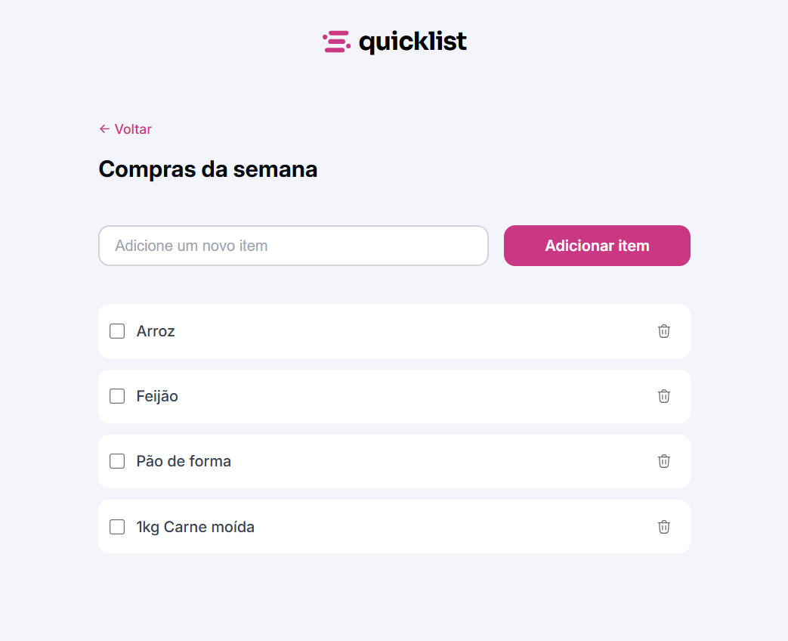

# 🛒 Quicklist - Lista de Compras

Este projeto é uma aplicação simples de lista de compras, desenvolvida para ajudar no gerenciamento de itens a serem adquiridos de forma rápida e eficiente.

## ✨ Visão Geral

A Quicklist permite que os usuários adicionem, visualizem e gerenciem seus itens de compra. O foco principal é a simplicidade e a usabilidade, com uma interface limpa e responsiva que se adapta a diferentes tamanhos de tela, proporcionando uma experiência fluida tanto em desktops quanto em dispositivos móveis.

## 🛠️ Tecnologias Utilizadas

[](https://skillicons.dev )

- **HTML**: Estrutura fundamental da aplicação.
- **CSS**: Estilização e design responsivo para uma interface moderna e adaptável.
- **JavaScript**: Lógica para adicionar, remover e gerenciar os itens da lista de compras.

## 🚀 Como Usar

1.  **Clone o repositório:**
    ```bash
    git clone https://github.com/FelipeFerreiraAmado/Quicklist.git
    ```
2.  **Navegue até o diretório do projeto:**
    ```bash
    cd Quicklist
    ```
3.  **Abra o arquivo `index.html` no seu navegador preferido.**

## 💡 Funcionalidades

-   **Adicionar Itens**: Insira novos itens na lista de compras.
-   **Remover Itens**: Exclua itens da lista que já foram comprados ou não são mais necessários.
-   **Interface Responsiva**: Adapta-se a diferentes tamanhos de tela para uma experiência de usuário consistente.

## 📸 Screenshots do Frontend

### Lista de Compras



## 🔮 Melhorias Futuras

-   Implementar persistência de dados (local storage) para que os itens da lista não sejam perdidos ao fechar o navegador.
-   Adicionar funcionalidade de marcar itens como comprados.
-   Categorização de itens.
-   Funcionalidade de busca e filtro.

## 🤝 Contribuição

Contribuições são sempre bem-vindas! Se você tem ideias para melhorar este projeto, sinta-se à vontade para:

1.  Fazer um fork do repositório.
2.  Criar uma nova branch (`git checkout -b feature/sua-feature`).
3.  Fazer suas alterações e commit (`git commit -m \'Adiciona nova feature\'`).
4.  Enviar para a branch (`git push origin feature/sua-feature`).
5.  Abrir um Pull Request.

## 📄 Licença

Este projeto está licenciado sob a licença MIT. Veja o arquivo [LICENSE](LICENSE) para mais detalhes.
